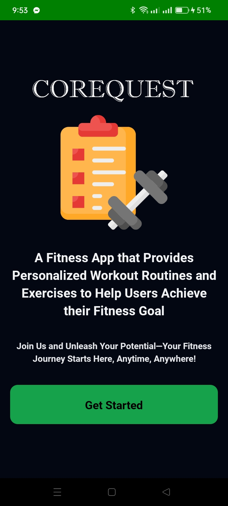
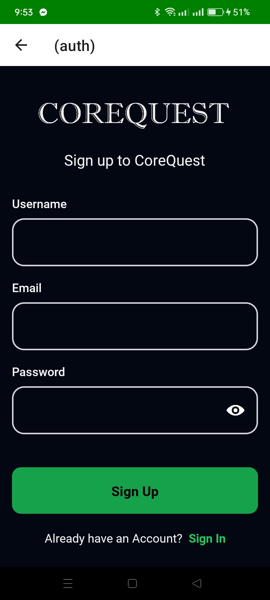
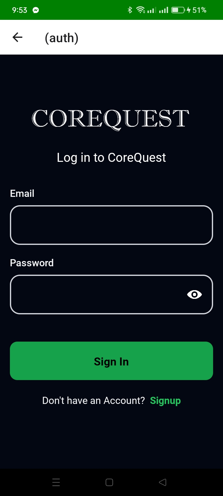
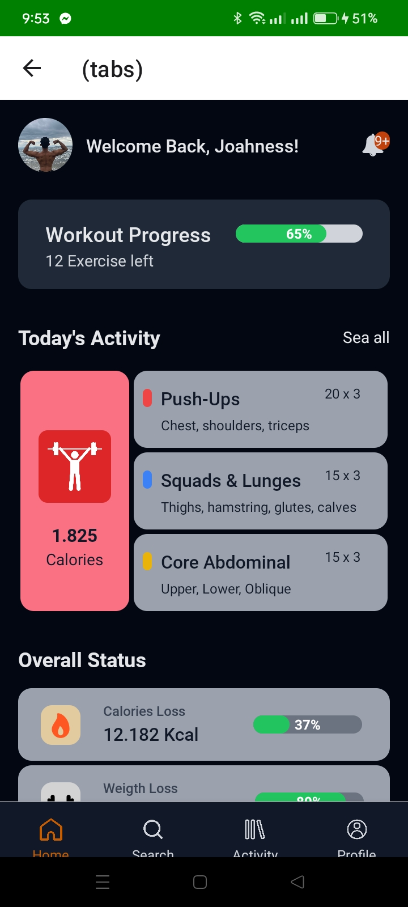
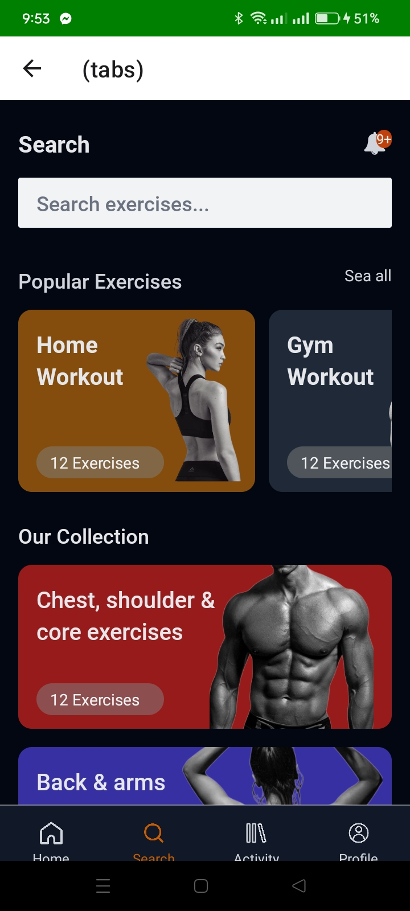
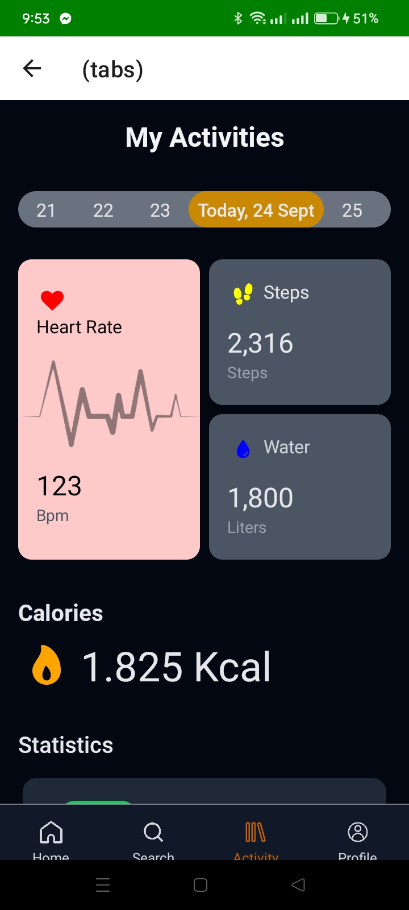
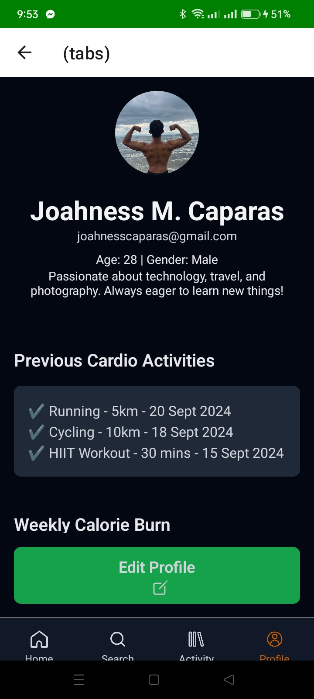

# CoreQuest App
CoreQuest Mobile App.

# Features
* Accurate Tracking
* Personalized Workout Plans
* User-Friendly Interface
* Motivational Tools

# Course Overview
* Basic React Native Components
* Database Design using Appwrite
* User Registration & Authenticaiton
* Deployment

# Tech Stack
* React Native
* AppWrite
* HTML, CSS and JS

# Screen Record of the App
* https://www.youtube.com/watch?v=tQ0oIi7yNEI

# Home Screen
  

# Sign Up Screen
  

# Sign In Screen
  

# Tabs Screen
  

